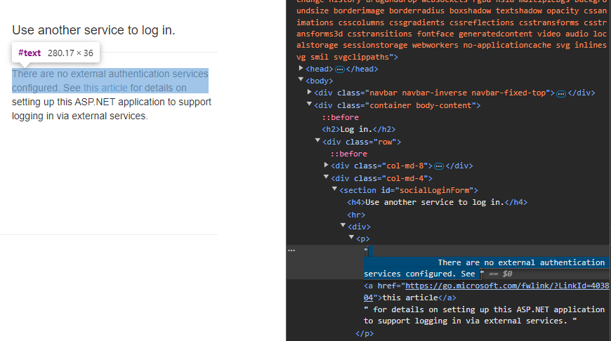
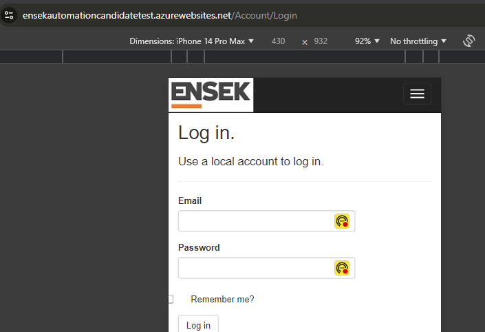
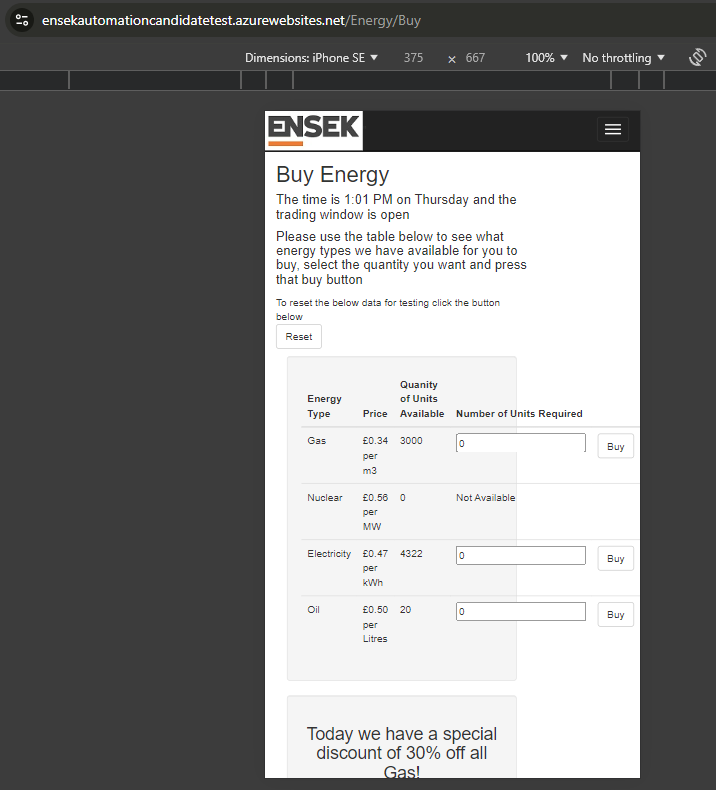
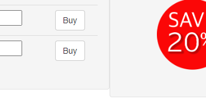

<!-- omit from toc -->
# ENSEK ReSoTE

This repository contains the documentation for Task 01 of the ENSEK Remote Software Tester Exercise.

- [The Task](#the-task)
  - [01 Test Plan Creation](#01-test-plan-creation)
  - [02 Test Plan Execution](#02-test-plan-execution)
  - [03 REST API Testing](#03-rest-api-testing)
- [First Ideas](#first-ideas)
- [The Plan](#the-plan)
  - [Main considerations](#main-considerations)
  - [Functional tests](#functional-tests)
    - [UI elements](#ui-elements)
      - [Homepage](#homepage)
      - [About](#about)
      - [Contact](#contact)
      - [Register](#register)
      - [Login](#login)
      - [Buy some energy](#buy-some-energy)
      - [Sell some energy](#sell-some-energy)
    - [Buy energy](#buy-energy)
    - [Register](#register-1)
    - [Login](#login-1)
- [Non-functional tests](#non-functional-tests)
  - [Performance tests](#performance-tests)
  - [Security tests](#security-tests)
  - [Exploratory tests](#exploratory-tests)
- [The Results](#the-results)
  - [Task 02 - web testing](#task-02---web-testing)
    - [Functional Issues](#functional-issues)
    - [Cosmetic issues](#cosmetic-issues)
    - [User Experience issues](#user-experience-issues)
  - [Task 03 - API testing](#task-03---api-testing)
- [Closing thoughts](#closing-thoughts)

# The Task

## 01 Test Plan Creation

> We have provided you with a URL link to a test system which is to be used for this test:
> 
> [https://ensekautomationcandidatetest.azurewebsites.net/](https://ensekautomationcandidatetest.azurewebsites.net/)
> 
> Based on the above application, you are required to create an approach for the testing that you are going to  
> perform. This approach can be in a format of your choice and it must clearly outline what you will be testing.
> 
> From the day you receive this test, you have 48 hours to submit your work for assessment.​
> 
> Please send it to ADDNAME@ensek.co.uk. Any work committed after the deadline won’t be considered  
> towards the assessment.​
> 
> It is advised to use a publicly accessible Git repository (like GitHub) to commit and share any collections and  
> documents with us.

## 02 Test Plan Execution

> Once you have completed the creation of your approach we would then like you to execute one of your test  
> cases against the application.
> 
> You will be required to record your results and test evidence for the test you execute, along with details of  
> any defects that you encounter during your testing.
> 
> You can again choose to record the defects in any suitable format.

## 03 REST API Testing

> Please use the swagger document [https://qacandidatetest.ensek.io/](https://qacandidatetest.ensek.io/) and automate the below tests around  
> the given endpoints, using a tool or framework of your choice:
> 
> Reset the test data
> 
> Buy a quantity of each fuel
> 
> Verify that each order from the previous step is returned in the /orders list with the expected details
> 
> Confirm how many orders were created before the current date
> 
> Automate any other validation scenarios that you would consider writing for this API
> 
> Record and share any defects identified.

# First Ideas

*   Keep the test plan/strategy as simple as possible
*   Keep bug reports as simple as possible (summary + screen)
*   Automate a selection of planned UI tests
    *   playwright
    *   Selenium + xUnit (time permitting)
*   Automate all REST API tests
    *   playwright
    *   RestSharp + xUnit (time permitting)
*   Include exploratory bug bash
*   Use html reports from playwright / xUnit as test evidence skeleton

# The Plan

## Main considerations

*   Automate  
    Even for the 2nd task, test execution, automate as much of the functional tests as possible. This gives repeatability, provides test plan and report.  
    Automating the tests also makes sure that features and their nuances get a high level of attention. Not to mention the pride effect.
*   No BDD  
    BDD is great if it's not only QA who use it. For this assignment, adding this extra layer above tests would only mean more typing, more complex GitHub integration, and a lot less options in reporting. The test scripts are descriptive enough to be readable. In most cases, at least.
*   Test data  
    A little bit unlike real-world applications, this is a test project with deliberate issues built in. Some are obvious, some hidden in the logic. Latter can be targeted by checking corner cases, hence those get a higher than usual priority in this assignment.
*   Velocity vs. Perfectionism  
    The goal is to show ability to provide more than reasonable results in a short period of time. Creating a lightweight framework that helps progress is more important than too much care about maintainability and extensibility. If the developing framework speeds up results, it doesn't need to show everything I can do.
*   Finding Issues vs. Reporting Issues
    By the deliberately broken nature of the systems under test in this assignment, some test scripts are less rigorous then they would be in a real-life project. In many cases test scripts are slightly bent to work around a built-in bug in order to continue the test and reach issues in areas beyond the first mistake. This admittedly leads to issues not reported by the scripts. This was a conscious decision made during test prototyping in order to dig deeper than the surface.
*   Beyond functionality  
    Much like in real-world projects, checking functionality is only part of the story. The approach considers some non-functional test areas.
*   Reporting issues  
    Time is quite short to follow the first ideas. The plan addresses the risk of running out of time by providing a detailed test list and a skeleton test evidence almost for free.

## Functional tests

Verify site functionality.  
Run the tests on major browser families, use desktop and mobile viewport sizes.

### UI elements

Verify that the UI elements are visible and testable.  
Verify text contents where applicable.  
Verify that the links / navigation buttons are visible and lead to where they meant to lead.  
Ignore functionality beyond this scope in these tests.

#### Homepage

https://ensekautomationcandidatetest.azurewebsites.net/

*   Logo, main heading
*   Home
*   About
*   Contact
*   Register
*   Log in
*   Find out more
*   Buy some energy
*   Sell some energy
*   About us

#### About

https://ensekautomationcandidatetest.azurewebsites.net/Home/About

*   Page title, description, footer
*   Find out more button

#### Contact

https://ensekautomationcandidatetest.azurewebsites.net/Home/Contact

*   Page title, description, footer

#### Register

https://ensekautomationcandidatetest.azurewebsites.net/Account/Register

*   Page title, description, footer
*   Register form

#### Login

https://ensekautomationcandidatetest.azurewebsites.net/Account/Login

*   Page title, description, footer
*   Local account
    *   Heading
    *   Login form
    *   Register link
*   External authentication
    *   Heading
    *   Description

#### Buy some energy

https://ensekautomationcandidatetest.azurewebsites.net/Energy/Buy

*   Page title, description, footer
*   Reset button
*   Buy table
*   Discount image
*   Back navigation

#### Sell some energy

https://ensekautomationcandidatetest.azurewebsites.net/Energy/Sell

*   Page title, footer
*   Maintenance image

### Buy energy

Verify energy buying functionality.  
Repeat the below cases with all available energy types (Gas, Nuclear, Electricity, Oil at the point of writing this).  
Verify the contents on confirmation page: quantity bought, quantity left.  
Go back to Buy Energy page and verify quantity left.

*   Buy an available amount of energy
*   Try to buy a more than available amount of energy when some is available
*   Try to buy energy when none is available
*   Try to buy a negative amount of energy when some is available
*   Try to buy a non-integer amount of energy when some is available
*   Try to buy a non-numeric amount of energy when some is available
*   Try to buy 2^31 units of energy when some is available
*   Set available amount to a negative number and try to buy a positive amount of energy - abandonned, no api support to prepare data
*   Set available amount to a negative number and try to buy a negative amount of energy - abandonned, no api support to prepare data

### Register

Verify local user registration.  
Verify confirmation/error message.  
Test data for email address validation: https://en.wikipedia.org/wiki/Email_address#Examples  
Note: wait for API response before giving up on UI side.

*   Register user with new details
*   Try to register without email
*   Try to register without password
*   Try to register without password confirmation
*   Try to register with invalid email address
*   Try to register with non-matching password and password confirmation
*   Try to register with simple password
*   Try to register a user with an already registered email - abandonned, cannot register user

### Login

Verify login functionality.  
Verify confirmation/error messages.

*   Login with valid credentials - abandonned, cannot register user
*   Try to login without email
*   Try to login without password
*   Try to login with valid email and invalid password
*   Try to login with invalid email and valid password
*   Try to login with invalid email and invalid password
*   Verify the 'Remember me' functionality - abandonned, cannot register user

# Non-functional tests

## Performance tests

This will be mostly done from API side with some UI torturing here.  
Repeat UI actions in quick succession for a period of time.

*   Navigation back and forth via links
*   Navigation back and forth via browser actions
*   Navigation back and forth via visiting URLs
*   Reset test data
*   Buy energy unit by unit

## Security tests

Get the system do it doesn't mean to.  
Mostly exploratory in this timeframe.

*   Look for plain text data in API requests and responses
*   SQL injection
*   Get raw error messages to find a lead to a breach

## Exploratory tests

Find issues typically not captured in structured testing.

*   Layout across a variety of OS, browser, viewport size, and orientation
*   Usability, general UX
*   Consistency
*   Spelling, grammar, phraseology
*   Image contents

# The Results

For simplicity and to save time, the issues found are listed only with descriptive summaries and screenshot/log as needed, rather than what any bug tracking system would require in a real project.
Many of the findings can be found in the test reports generated by the automated tests.  
I ask the reader to read the linked test reports (or even run the tests), and in this document I will mention some of the items found by the automated tests but will focus on issues found manually either during prototyping the test scripts or during exploratory testing.

## Task 02 - web testing
Example UI test summary: [https://github.com/gazdi/ENSEK-assignment/actions/runs/11160772176#summary-31021931211](https://github.com/gazdi/ENSEK-assignment/actions/runs/11160772176#summary-31021931211)
Example UI test report (76MB): [https://github.com/gazdi/ENSEK-assignment/actions/runs/11160772176/artifacts/2010514888](https://github.com/gazdi/ENSEK-assignment/actions/runs/11160772176/artifacts/2010514888)
### Functional Issues
1. About page: 'Find out more about us' link leads to 'https://www.ensek.com/about' instead of https://www.ensek.com/about-us
2. Contact page: No contact form on page
3. Sell Energy page: permanently in maintenance
4. Buy Energy page: the time is displayed in UTC rather than local time, currently one hour behind
5. Buy Energy page: missing validation on the required units field in many cases a.k.a. 'a software tester walks into a bar'
    * can buy more than available
    * can buy negative amount
    * unhandled conversion error when buying a fractional amount
    * unhandled conversion error when buying a non-numeric amount
    * unhandled conversion error when buying 2^31 units (just outside the upper limit of signed Int32)
6. Buy Energy page: As a result of the previous issue, available amount may go below 0
7. Buy Energy page: Could not find a time when the trading window was not open (this certainly helped testing and assignment progress but could be an issue)
8. Register page: cannot complete any valid registration attempt, SQL server/instance not found
9. Register page: email validation does not follow RFC5322
    * some valid email addresses are found invalid (e.g. email@\[123.123.123.123\])
    * some invalid email addresses are found valid (e.g. Abc..123@example.com)
10. Login page: most of testing was blocked by the lack of Register functionality

### Cosmetic issues
1. About page: 'About ENSEK Energy Corp..' with two dots
2. Contact page: error image says 'ERORR' instead of 'ERROR'
3. Login page and some others: extra whitespace characters around text elements, e.g. invisible spaces and line breaks around the 'There are no external authentication services configured.' paragraph

4. Login page: 'Remember me' checkbox is partially out of viewport

5. Buy Energy page: typo in a column header, 'Quanity of Units Available' with a missing 't', should be 'Quanity of Units Available'
6. Buy Energy page: typo in the unit type of Oil, 'Litres' with capital L, should be 'litres'
7. Buy Energy page: inconsistent discount text and image, text says 30%, image shows 20%
8. Buy Energy page: on mobile or other small viewports (less than 560px wide) the layout falls apart slightly

9. Buy Energy page: slightly different size of table well and discount well in large (wider than 1200px) viewports

10. 

### User Experience issues
1. Inconsistent closing periods
    * in page titles, e.g. 'Buy Energy' but 'Contact.'
    * in larger bodies of text e.g. 'But it didn’t happen overnight. Here’s our story.' but 'To reset the below data for testing click the button below' 
2. Navigation bar does not have linkt to Buy Energy and Sell Energy pages
3. 

## Task 03 - API testing
Example API test summary: [https://github.com/gazdi/ENSEK-assignment/actions/runs/11163097306#summary-31029226890](https://github.com/gazdi/ENSEK-assignment/actions/runs/11163097306#summary-31029226890)
Example API test report: [https://github.com/gazdi/ENSEK-assignment/actions/runs/11163097306/artifacts/2011044201](https://github.com/gazdi/ENSEK-assignment/actions/runs/11163097306/artifacts/2011044201)
1. All endpoints apart from post_reset (/ENSEK/reset) can be successfully called without a access token or with an invalid one, would be a huge security red flag in a real project
2. put_buy (PUT /ENSEK/buy) calculates with 0.6 oil unit price while get_energy (GET /ENSEK/energy) reports 0.5
3. put_buy (PUT /ENSEK/buy) respond includes 'orderid' in one word for Oil but 'order id' for Gas and Electricity
4. Parallel logins override each other, apparently the backend only accepts the most recently generated access key across all users
    * This only limits usage of post_reset, see first API issue
5. 

# Closing thoughts
Well, this was fun.
There are many more ideas to implement, I'll name some.
* Add more details to the test plan, the small things that got used or built in the solution but were not mentioned
* Rework the bug list with more supporting data
* Make the UI tests quicker by reusing the browser
* Make assertion messages more descriptive
* Schema validation in the API tests - the lack of this hurts me most, probably
* 
It is time to send this in.